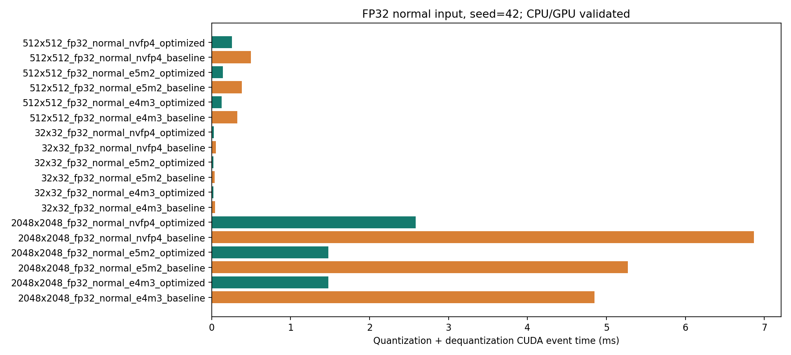
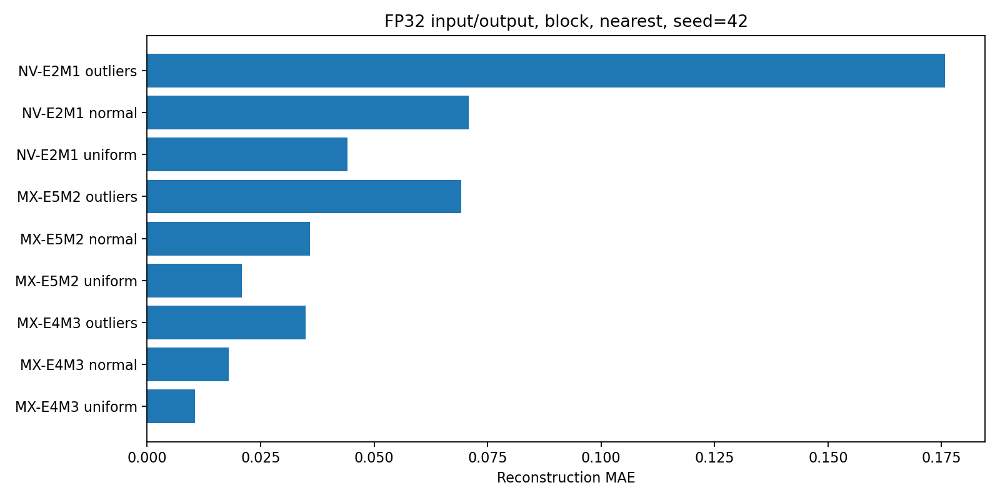

# 实验报告：MXFP8 / NVFP4 CUDA 软件模拟

最终数据：[20260920_194743 汇总](../results/20260920_194743/summary.md)，[原始命令](../results/20260920_194743/commands.json)，[环境](../results/20260920_194743/environment.log)。本报告由 `scripts/write_report.py` 读取真实 CSV 汇总生成。

## 1. 要求与范围

依据项目 PDF 第1页总则、第3–5页选题二，完成 MXFP8-E4M3、MXFP8-E5M2 和 NVFP4-E2M1。支持 FP32/FP16 文件输入，FP16/BF16/FP32 输出，tensor/block，nearest/stochastic；保存真实 packed 数据和全部必要 scale，独立进程仅加载低精度文件即可 CUDA 反量化。

逐条映射见 [requirements_matrix.md](requirements_matrix.md)。核心实现、编译、CPU 测试与 RTX 3090 测试均已通过。

## 2. 格式与数值约定

[完整规则及一手来源](numerics.md)：OCP MX v1.0（2023-09）、NVIDIA NVFP4 官方说明（2025-06-24）。E4M3 为 bias 7、最大 448、有 ±0 与 NaN 而无 Inf 的 OCP 变体；E5M2 为 bias 15、最大 57344、含 Inf/NaN；E2M1 正数为 0, 0.5, 1, 1.5, 2, 3, 4, 6。

元素用 RNE 或相邻值距离随机舍入，溢出采用 SAT；随机数由 seed 和逻辑元素索引确定。scale 编码与输出转换独立决定舍入，不受元素 stochastic 开关影响。矩阵拒绝 NaN/Inf，底层编解码仍测试特殊编码。全零、符号零、极值和次正规策略见 [numerics.md](numerics.md)。

## 3. 缩放、布局与恢复

MX 的块最大绝对值 a：e = clamp(ceil(log2(a/max_element)), -127, 127)，真实 E8M0 存 e+127，零块 scale=1。q = encode(x/2^e)，y = decode(q)*2^e。

NV 全局 g = FP32(max(A/2688, 2^-126))，零张量 g=1；局部 s = E4M3_RNE(a/(6g))，非零块下溢时提升至最小正 scale。量化必须用恢复后的 s：q = E2M1(x/(decode(s)*g))，y = decode(q)*decode(s)*g。局部 scale 是 1 字节，全局是 4 字节。

NV 每字节低半字节对应偶数元素，高半字节对应奇数元素。奇数长度最后高半字节 0；行/块尾无 padding。文件 header 逐字段 little endian 序列化，[文件规范](file_format.md) 列出全部 offset 和验证规则。

## 4. 标准参数与扩展

默认 MX 块 32、NV 块 16，沿张量的行方向分块：每行独立按 block_size 切块，块不跨行。tensor 和尾块是显式项目扩展，文件有标志；非默认块大小直接拒绝。本容器不是 Blackwell 硬件 scale swizzle 格式，未做 OCP 全操作认证；矩阵采用 SAT，未提供独立 OVF 转换模式。

## 5. CPU/GPU 分工

CPU 负责 CLI、文件验证、实验调度、长期误差累加；CPU 参考实现也可独立完成全过程（ENABLE_CUDA=OFF）。CPU 正式性能为单线程 C++17 Release -O3，无 -O0 基准。

GPU 完成输入 amax 并行归约、scale 编码、低精度编码与打包，以及解包、乘 scale、输出转换。全局归约 256 线程/block，网格步长扫描并 atomicMax 合并非负 float；每 warp 归约一个 32/16 元素量化块；每线程拥有一个完整 packed byte；NV 一次恢复两个元素。BF16 由位操作软件 RNE 转换。CUDA 错误在 API、launch 和同步边界检查，设备资源用 RAII 释放。

## 6. 正确性结果

独立标量参考以整数位权求和验证全部 256 个 E4M3、256 个 E5M2、16 个 E2M1 编码，枚举有限值往返、全部相邻中点及两侧，覆盖指数边界。FP16/BF16 全位模式有限值往返与 ties 测试通过。100000 次随机舍入概率检查通过。

主矩阵测试覆盖 72 配置 × 8 边界 shape × 3 分布 = 1728 用例；另有 288 个零/常数/混合/离群块组合、FP32 最大值与最小次正规、手算 0x32/0x07 打包、截断/元数据/非法配置/非有限输入拒绝测试。CPU、GPU baseline、GPU optimized 的 packed、scale、输出逐位一致（实现误差为 0），不通过放宽阈值掩盖差异。

文件在保存后关闭并重新读取，独立 dequantize 命令不依赖原始输入。compute-sanitizer memcheck=0 errors；racecheck=0 hazards。实验质量表另有 216 种格式/输入/输出/scale/round/distribution 组合，误差以实际存储 FP16 值为参考，累加使用 long double。

[测试日志](../results/20260920_194743/tests.log) · [质量CSV](../results/20260920_194743/quality.csv) · [内存检查](../results/20260920_194743/memcheck.log) · [竞争检查](../results/20260920_194743/racecheck.log)

## 7. 三条路径实际指标

以下为 2048×2048、正态 N(0,1)、seed 42、block/nearest、FP16 输出、optimized，warmup 3 / repeat 5。时间为均值 ms，更多分项及标准差见汇总；所有指标由实际数据生成。

|格式/输入|最大绝对误差|MAE|MSE|payload压缩|文件压缩|量化ms|反量化ms|逻辑GB/s|含传输加速|文件E2E加速|
|---|---|---|---|---|---|---|---|---|---|---|
|MX-E4M3/FP16|0.25|0.0179677|0.000705467|1.93939|1.93935|1.85239|0.129069|98.5292|59.9384|12.01|
|MX-E5M2/FP16|0.496094|0.0358417|0.00279605|1.93939|1.93935|1.8526|0.130016|97.8132|67.0671|13.31|
|NV-E2M1/FP16|0.646484|0.0715042|0.009063|3.55555|3.55541|3.04269|0.29017|37.0417|45.4039|9.721|
|MX-E4M3/FP32|0.248139|0.0179676|0.00070538|3.87879|3.8787|1.35166|0.128819|98.712|74.3805|10.17|
|MX-E5M2/FP32|0.494898|0.0358419|0.002796|3.87879|3.8787|1.35052|0.128819|98.712|84.3105|11.14|
|NV-E2M1/FP32|0.645877|0.0715033|0.00906309|7.1111|7.11079|2.2972|0.289792|37.0902|53.5912|8.16|




## 8. 有证据的优化

引入优化前，2048² E4M3 baseline 量化 + 反量化约 4.85 ms（见下表同 case 的 baseline 列）。分析发现二分查找内反复调用 double `ldexp`；保留清晰的 baseline，新增 `decode_fast` 直接构造精确 FP32 位域，`encode_fast` 保持同样的相邻比较、舍入和随机索引，NV scale 同样复用它。这是针对内核算法的优化，不凑四种优化。

下表为本次 run 同条件 FP32 正态数据，显示全量化 + 反量化 kernel 时间比。小规模受启动开销和桌面 GPU 波动影响，不要求每项都改善。

|shape/格式|baseline kernel ms|optimized kernel ms|前后比|
|---|---|---|---|
|2048x2048_fp32_normal_e4m3_baseline|4.84968|1.48048|3.28x|
|2048x2048_fp32_normal_e5m2_baseline|5.27197|1.47934|3.56x|
|2048x2048_fp32_normal_nvfp4_baseline|6.8683|2.587|2.65x|
|32x32_fp32_normal_e4m3_baseline|0.0418176|0.023552|1.78x|
|32x32_fp32_normal_e5m2_baseline|0.0389312|0.0243712|1.6x|
|32x32_fp32_normal_nvfp4_baseline|0.0532736|0.0289408|1.84x|
|512x512_fp32_normal_e4m3_baseline|0.328339|0.128608|2.55x|
|512x512_fp32_normal_e5m2_baseline|0.381786|0.145331|2.63x|
|512x512_fp32_normal_nvfp4_baseline|0.49943|0.25719|1.94x|

小矩阵 1024 元素，含传输加速范围 0.646–1.07x；文件端到端范围 0.713–0.828x。
中/大矩阵 optimized 含传输加速范围 27.8–84.3x；文件端到端范围 6.92–13.3x。

总体性能要求在中/大矩阵上达到；小矩阵未普遍达到，启动、分配、传输及文件开销使 GPU 不占优。优化已降低 kernel 时间，但不能消除这些固定开销；不把纯 GPU kernel 与 CPU 文件 I/O 对比。

Nsight Systems 在 1024² NVFP4 optimized 上显示，`make_scales` 占 kernel 时间 58.8%、`encode_kernel` 26.7%、`decode_kernel` 11.5%。后续可优先优化 scale 并行映射或与编码融合。ncu 因权限不足未采集到计数器，因此没有 DRAM 或 occupancy 实测数字。（nsys 分析见 `nsys/nsys-stats.log`。）

## 9. 计时、压缩率和带宽口径

CUDA Events 同轮边界：0→1 H2D，1→2 scale（含必要归约、global、初始化），2→3 编码/打包，1→3 完整量化，3→4 解包/反量化，4→5 D2H。分项不跨轮拼接；设备内存分配、文件 I/O 和日志不在 kernel 区间。GPU 同步复制和事件之间可能存在主机提交间隙，特别在小矩阵上会影响 event 时间。

process_ms 在调用完整 GPU API 之前开始，返回之后结束，包含主机与设备输出分配、事件管理、H2D、量化/反量化、D2H、同步及资源释放。CPU 对应量化 + 反量化也包含其向量分配，使用同一输入与配置。kernel_speedup 是 CPU 计算 API 时间/(GPU 量化 + 反量化 Events)，process_speedup 才是包含传输资源成本的比较。

文件 E2E：双方均从输入文件读 → 量化 → 关闭低精度文件 → 重开 → 独立反量化 → 写输出并关闭，包含分配/传输；统计使用缓存后的文件系统，不执行 fsync，不是冷盘吞吐。CSV 记录 CPU/GPU 双方 E2E。输入生成不计入阶段计时。

payload_ratio = input_payload/(packed + local_scales + NV_global_4_bytes)。MX 文件固定 global=1 字段是容器元数据，不是额外必要 scale。file_ratio = (48+input_payload)/(112+packed+local_scales)。NV 奇数多出的半字节已计入 packed ceil(N/2)。

反量化逻辑有效 GB/s = (packed_bytes + scale_bytes + NV_global_4_bytes + output_bytes) / (dequant_ms * 10^6)。这是每段至少读取一次的逻辑流量下界，不是 profiler DRAM 流量，也不统计每线程重复读取/缓存命中。分 FP16/FP32 输入报告压缩，三种输出转换的误差在 quality.csv 里分别列出。

## 10. 实测环境与复现

Ubuntu 20.04.6，Intel i9-14900KF；RTX 3090 24GiB / compute capability 8.6；driver 570.169，Toolkit 12.6.20（nvidia-smi 的 12.8 表示驱动兼容上限，不是 Toolkit 版本），GCC 9.4，CMake 3.16.3。CPU 单线程 -O3，CUDA -O3 --fmad=false -arch=sm_86，未用 fast-math。桌面 Xorg/浏览器等其他 GPU 进程保持运行，温度/频率与共享 GPU 造成波动，原始每轮值和标准差均保留。

```bash
python3 scripts/reproduce.py quick
python3 scripts/reproduce.py full
```

每次 run_id 隔离，完整保存配置、seed、环境、构建缓存、命令、日志、原始 CSV/JSON 和 PNG/SVG。CPU 可用 ENABLE_CUDA=OFF 独立构建。能编译到某个目标，不等于在那个硬件上验证过：当前只在 sm_86 的 3090 验证；修改 CUDA_ARCH 可以重新编译其他目标，但没有其他硬件的通过证据。

## 11. 限制与未验证项

ncu 计数器权限不足，未采集 DRAM/occupancy。其他 GPU 或国产平台未实测；不提供原生 FP8/FP4 Tensor Core 额外路径。小矩阵整体性能未普遍超过 CPU。配置为本项目键值子集，不是通用 TOML 解析器；文件结构验证没有 checksum，合法 payload 位翻转不能检测。文件 E2E 不是 fsync 持久化性能。

## 12. 后续优化方向

可在当前数据基础上优化 NV scale 串行 lane 工作、融合 block scale 与编码、持久设备缓冲及 pinned host 内存，减少小矩阵固定成本。每项必须保留逐位测试和新的同条件前后数据。CPU 多线程/SIMD 基准可作为更强后续对照，本报告加速比仅相对明确的单线程 -O3 参考实现。

## 13. 目录与构建约定

源码按 `include/`、`src/`、`tests/`、`configs/`、`scripts/`、`docs/` 分目录，构建产物和实验位于忽略目录。正式源码里没有临时调试内容，生成物与源码分离，统一 clang-format 样式，核心数值与线程映射有中文原因注释。